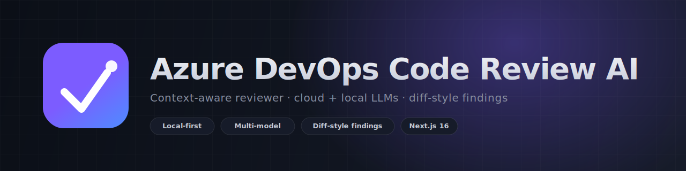

# Reviso



Reviso is an enterprise-grade, context-aware AI reviewer for Azure DevOps pull requests. Tool reads PR diff, linked work items, related PR history, and repository coding practices, then produces actionable review findings in diff-style format.

## Why This Project

Teams need more than syntax checks. This platform enforces team conventions and architectural expectations using:

- Live Azure DevOps context
- Repository-wide style profile extraction
- Multi-model review orchestration (cloud + local)
- Deterministic finding schema for CI/CD and governance

## Core Capabilities

- PAT-based Azure DevOps access
- Auto-discovery of accessible organizations/projects/repositories
- Multi-selection of repositories for context extraction
- PR review by PR number
- Linked work item ingestion
- Related PR awareness
- Coding-style profile generation from local repositories
- Model auto-discovery for OpenAI, Anthropic, Gemini, Ollama, LM Studio
- Diff-style findings with rationale and better-code suggestion

## Architecture

- `src/app` - Next.js App Router UI and API endpoints
- `src/lib/azure-devops.ts` - Azure discovery and PR context collector
- `src/lib/style-profile.ts` - local codebase convention mining
- `src/lib/llm.ts` - provider/model adapters
- `src/lib/review-engine.ts` - review orchestration pipeline
- `data/` - local settings/profile persistence

## Quick Start

```bash
npm install
npm run dev
```

Open `http://localhost:3000`.

## Docker

```bash
docker compose up --build
```

## Product Flow

1. Enter Azure DevOps PAT
2. Fetch accessible repositories
3. Select one or many repositories for context
4. Configure AI provider + model
5. Analyze style profile
6. Run review on PR number

## Azure DevOps PAT Permissions

Use a PAT from same user account that can access target org/project/repos.  
Minimum recommended scopes:

- `Code (Read)`  
Needed to list repositories, read pull requests, iterations, and changed files.

- `Work Items (Read)`  
Needed to read linked work items from PR and pull ticket context.

- `Project and Team (Read)`  
Needed to enumerate projects and repo discovery context.

- `Member Entitlement Management / Profile (Read)`  
Needed for account/profile discovery used by PAT-based organization lookup.

Optional (only if you later enable writing review comments back to Azure DevOps):

- `Code (Read & Write)`  
Needed to create PR threads/comments from this app.

## Security Notes

- PAT and provider tokens are persisted locally in per-user settings under `data/settings/`
- Recommended next step for production: encrypted secret storage (DPAPI/KMS/Vault)

## Branding Assets

- Logo: `public/reviso-icon.png`
- App icon / favicon: `src/app/icon.png`
- GitHub header: `public/github-header.svg`

## License

MIT
